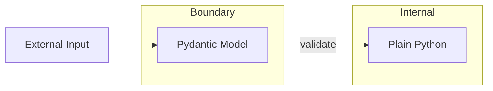

# ADR-004: Prescribed Dependencies for Consumers

| Field | Value |
|-------|-------|
| Status | Proposed |
| Date | 2025-12-28 |
| Deciders | TBD |
| Related | [ADR-001](001-python-dev-framework-architecture.md), [ADR-005](005-testing-coverage-strategy.md), [ADR-010](010-python-version-compatibility.md), [ADR-013](013-immutability-safety-patterns.md), [TDD-002](../tdd/002-gcp-logging-integration.md) |

## Context

Consumer projects need consistent libraries for common concerns (validation, logging, testing). Allowing arbitrary choices creates fragmentation, inconsistent patterns, and knowledge silos across teams.

## Decision

Prescribe specific dependencies for consumer projects adopting this framework.

### Required Dependencies

| Dependency | Purpose | Version | Rationale |
|------------|---------|---------|-----------|
| pydantic | API boundary validation | >=2.0 | Industry standard, Pydantic v2 performance |
| structlog | Structured logging | >=24.1 | JSON output, GCP Cloud Logging compatible ([TDD-002](../tdd/002-gcp-logging-integration.md)) |
| useful-types | Type safety utilities | >=0.2.1 | SequenceNotStr protocol ([ADR-013](013-immutability-safety-patterns.md)) |

### Required Dev Dependencies

| Dependency | Purpose | Version | Rationale |
|------------|---------|---------|-----------|
| pytest | Testing framework | >=8.0 | Standard, extensive ecosystem ([ADR-005](005-testing-coverage-strategy.md)) |
| pytest-cov | Coverage reporting | >=4.0 | Coverage.py integration ([ADR-005](005-testing-coverage-strategy.md)) |
| mypy | Type checking | >=1.11 | Strict mode support |
| ruff | Linting | >=0.6 | Fast, comprehensive |
| black | Formatting | >=24.0 | Deterministic, zero config |
| pre-commit | Git hooks | >=3.8 | Hook management |
| typing-extensions | Type backports | >=4.0 | Python 3.9-3.10 compatibility ([ADR-010](010-python-version-compatibility.md)) |

### Optional Dev Dependencies

| Dependency | Purpose | Version | When Needed |
|------------|---------|---------|-------------|
| cchooks | Hook development SDK | >=0.1.0 | Only if building project-specific Claude Code hooks |

### Pydantic Usage Pattern

Validate at API boundaries only:



**API boundaries include:**
- REST endpoint request/response bodies
- CLI argument parsing
- Configuration file loading
- Message queue payloads
- External service responses

**Not API boundaries:**
- Internal function calls
- Domain model construction
- Database entities (use ORM models)

### structlog Usage Pattern

```python
import structlog
log = structlog.get_logger()

# Structured key-value logging
log.info("user_created", user_id=123, email="user@example.com")
log.error("payment_failed", order_id=456, reason="insufficient_funds")
```

**Enforcement:**
- Ruff T201 rule bans `print()` in `src/`
- CLAUDE.md documents logging patterns

### structlog Configuration (Code-Based)

Configure in application entry point (not via external JSON):

```python
# src/package_name/logging_config.py
from __future__ import annotations

import logging
import os
import structlog


def configure_logging(*, json_output: bool | None = None) -> None:
    """Configure structlog for application."""
    if json_output is None:
        json_output = os.getenv("ENV", "development") != "development"

    processors: list[structlog.types.Processor] = [
        structlog.contextvars.merge_contextvars,
        structlog.processors.add_log_level,
        structlog.processors.TimeStamper(fmt="iso"),
    ]

    if json_output:
        processors.append(structlog.processors.JSONRenderer())
    else:
        processors.append(structlog.dev.ConsoleRenderer())

    structlog.configure(
        processors=processors,
        wrapper_class=structlog.make_filtering_bound_logger(logging.INFO),
        context_class=dict,
        cache_logger_on_first_use=True,
    )
```

**Rationale:** Code-based configuration is simpler, type-safe, and avoids file parsing overhead. JSON config files are not recommended.

For GCP Cloud Logging integration, see [TDD-002](../tdd/002-gcp-logging-integration.md).

### GCP Optional Dependencies

For GCP Cloud Functions/Cloud Run deployments:

```toml
[project.optional-dependencies]
gcp = [
    "google-cloud-logging>=3.10.0",
]
```

### Consumer pyproject.toml Template

```toml
[project]
requires-python = ">=3.9"
dependencies = [
    "pydantic>=2.0",
    "structlog>=24.1",
    "useful-types>=0.2.1",
]

[project.optional-dependencies]
dev = [
    "pytest>=8.0",
    "pytest-cov>=4.0",
    "mypy>=1.11",
    "ruff>=0.6",
    "black>=24.0",
    "pre-commit>=3.8",
    "typing-extensions>=4.0",
    "cchooks>=0.1.0",
]
gcp = [
    "google-cloud-logging>=3.10.0",
]
```

## Alternatives Considered

| Alternative | Rejected Because |
|-------------|------------------|
| No prescriptions | Fragmentation, inconsistent patterns |
| attrs instead of pydantic | Less ecosystem support, no built-in validation |
| stdlib logging | No structured output, verbose configuration |
| loguru | Less control, implicit global state |
| dataclasses for validation | No runtime validation, manual implementation |

## Consequences

### Positive
- Consistent patterns across all projects
- Reduced decision fatigue
- Shared knowledge and documentation
- Easier onboarding

### Negative
- Less flexibility for edge cases
- Version lock-in across projects
- Learning curve for unfamiliar libraries

### Risks

| Risk | Mitigation |
|------|------------|
| Dependency abandonment | Chosen libraries are well-maintained, industry standard |
| Breaking changes in major versions | Pin minimum versions, test before upgrading framework |
| Performance issues | Both pydantic v2 and structlog are optimized |

## Approval Checklist

- [ ] Dependency versions tested together
- [ ] Usage patterns documented in CLAUDE.md
- [ ] Consumer template validated
- [ ] Migration guide for existing projects
