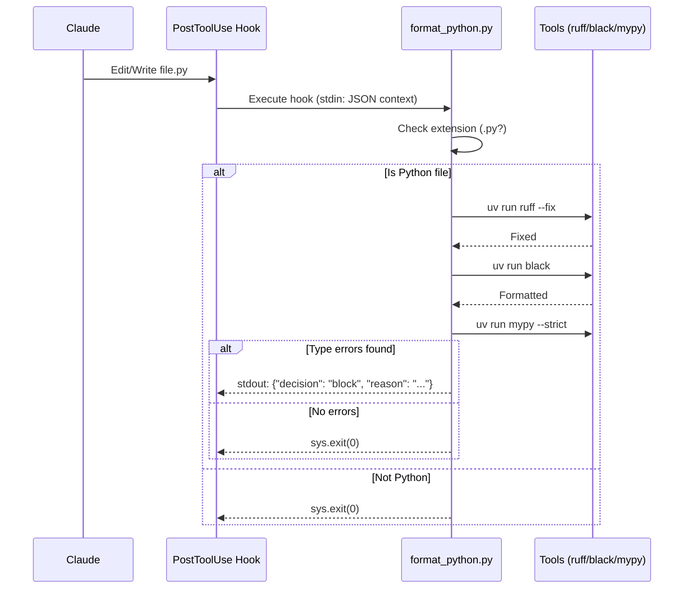
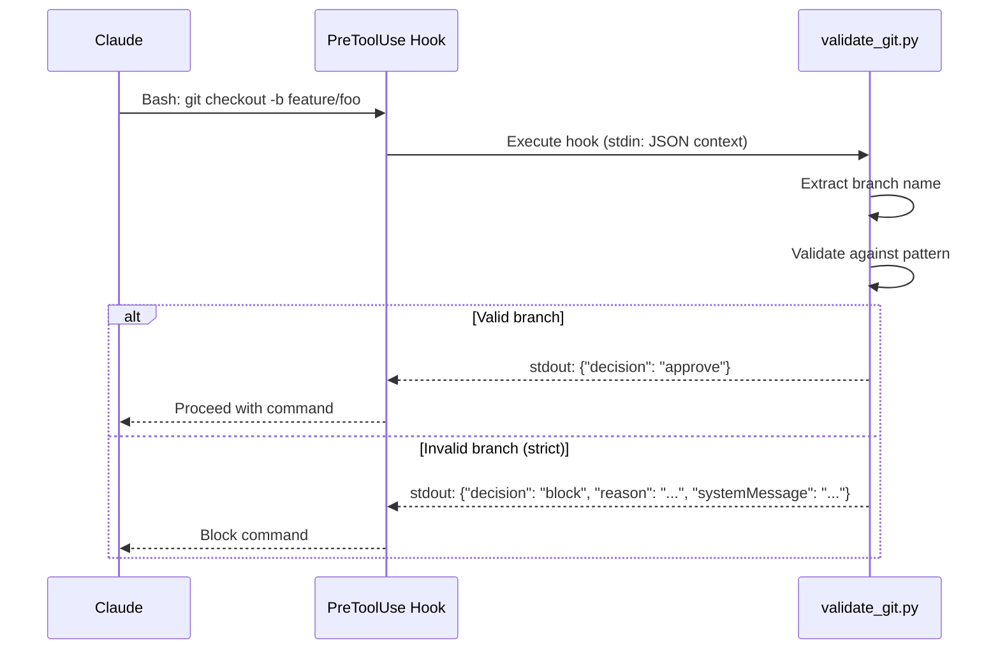

# TDD-001: Python Development Framework Plugin Implementation

| Field | Value |
|-------|-------|
| Version | 0.2.0 |
| Date | 2025-12-29 |
| Related ADRs | ADR-001, ADR-002, ADR-003, ADR-004, ADR-005 |

## Overview

Technical implementation details for the Python Development Framework Claude Code plugin.

## Directory Structure

```
python-dev-framework/
├── .claude-plugin/
│   ├── plugin.json
│   └── hooks/
│       ├── hooks.json
│       └── scripts/
│           ├── config.py          # Shared configuration loader
│           ├── format_python.py   # PostToolUse hook
│           └── validate_git.py    # PreToolUse hook
├── skills/
│   └── python-standards/
│       └── SKILL.md
├── CLAUDE.md
├── pyproject.toml
├── uv.lock
├── tests/
│   ├── __init__.py
│   ├── conftest.py
│   ├── test_config.py
│   ├── test_format_python.py
│   └── test_validate_git.py
├── docs/
│   ├── adr/
│   └── tdd/
├── CHANGELOG.md
└── README.md
```

## Hook Execution Flow

Per [ADR-002](../adr/002-two-layer-enforcement-model.md), enforcement occurs at two layers.

### PostToolUse: Python Formatting



### PreToolUse: Git Validation



## Component Specifications

### 1. Plugin Manifest

**File:** `.claude-plugin/plugin.json`

```json
{
  "name": "python-dev-framework",
  "version": "0.1.0",
  "description": "Opinionated Python development enforcement for Claude Code",
  "author": {
    "name": "World Central Kitchen"
  },
  "repository": "https://github.com/wck-org/python-dev-framework",
  "license": "MIT",
  "keywords": ["python", "linting", "formatting", "git-workflow"]
}
```

### 2. Claude Code Environment Variables

Claude Code provides these environment variables to hooks at runtime:

| Variable | Scope | Description |
|----------|-------|-------------|
| `${CLAUDE_PLUGIN_ROOT}` | Plugin hooks | Absolute path to plugin installation directory |
| `$CLAUDE_PROJECT_DIR` | All hooks | Absolute path to project root (where Claude Code started) |
| `$CLAUDE_ENV_FILE` | SessionStart only | Path to file for persisting env vars across session |
| `$CLAUDE_CODE_REMOTE` | All hooks | `"true"` if running in remote/web environment |

**Usage in hooks.json:**
```json
"command": "python ${CLAUDE_PLUGIN_ROOT}/hooks/scripts/format_python.py"
```

**Usage in Python:**
```python
import os
project_dir = os.environ.get("CLAUDE_PROJECT_DIR", ".")
```

### Hook I/O Protocol

Hooks receive context via **stdin** as JSON and respond via **stdout** as JSON.

**Stdin Context (all hook types):**
```json
{
  "tool_name": "Edit",
  "tool_input": {"file_path": "/path/to/file.py", "...": "..."},
  "cwd": "/project/root"
}
```

**Stdout Response (PreToolUse):**
```json
{"decision": "approve"}
```
or
```json
{"decision": "block", "reason": "User-visible reason", "systemMessage": "Guidance for Claude"}
```

**Stdout Response (PostToolUse):**
```json
{"decision": "block", "reason": "Issue description"}
```
Note: PostToolUse cannot actually block (tool already executed). The "block" decision prompts Claude to address the issue.

### 3. Hook Configuration

**File:** `.claude-plugin/hooks/hooks.json`

```json
{
  "description": "Python development enforcement hooks",
  "hooks": {
    "PostToolUse": [{
      "matcher": "Edit|Write",
      "hooks": [{
        "type": "command",
        "command": "python ${CLAUDE_PLUGIN_ROOT}/hooks/scripts/format_python.py",
        "timeout": 30
      }]
    }],
    "PreToolUse": [{
      "matcher": "Bash",
      "hooks": [{
        "type": "command",
        "command": "python ${CLAUDE_PLUGIN_ROOT}/hooks/scripts/validate_git.py",
        "timeout": 10
      }]
    }]
  }
}
```

### 4. Configuration Loader

**File:** `.claude-plugin/hooks/scripts/config.py`

```python
"""Shared configuration loader for plugin hooks."""
from __future__ import annotations

import json
import os
from dataclasses import dataclass, field
from pathlib import Path
from typing import Literal

StrictnessLevel = Literal["strict", "moderate", "minimal"]

DEFAULT_BRANCH_TYPES = [
    "feature", "bugfix", "hotfix", "refactor", "docs", "test", "chore"
]
DEFAULT_COMMIT_TYPES = [
    "feat", "fix", "docs", "style", "refactor", "perf",
    "test", "build", "ci", "chore", "revert"
]


@dataclass
class PluginConfig:
    """Plugin configuration with defaults."""

    level: StrictnessLevel = "strict"
    branch_types: list[str] = field(default_factory=lambda: DEFAULT_BRANCH_TYPES.copy())
    commit_types: list[str] = field(default_factory=lambda: DEFAULT_COMMIT_TYPES.copy())


def load_config() -> PluginConfig:
    """Load plugin configuration from consumer project settings.

    Reads from $CLAUDE_PROJECT_DIR/.claude/settings.json.
    Returns defaults if file missing or invalid.
    """
    project_dir = os.environ.get("CLAUDE_PROJECT_DIR", ".")
    settings_path = Path(project_dir) / ".claude" / "settings.json"

    if not settings_path.exists():
        return PluginConfig()

    try:
        data = json.loads(settings_path.read_text())
        plugin_config = data.get("plugins", {}).get("python-dev-framework", {})

        level = plugin_config.get("level", "strict")
        if level not in ("strict", "moderate", "minimal"):
            level = "strict"

        return PluginConfig(
            level=level,
            branch_types=plugin_config.get("branch_types", DEFAULT_BRANCH_TYPES),
            commit_types=plugin_config.get("commit_types", DEFAULT_COMMIT_TYPES),
        )
    except (json.JSONDecodeError, TypeError, KeyError):
        return PluginConfig()
```

### 5. Format Python Hook

**File:** `.claude-plugin/hooks/scripts/format_python.py`

```python
#!/usr/bin/env python3
"""Auto-format and type-check Python files after Edit/Write operations.

PostToolUse hook that runs ruff, black, and mypy on .py/.pyi files.
Behavior varies by strictness level per ADR-002.

Note: PostToolUse hooks react to completed operations. They cannot
block execution (tool already ran) but can perform post-processing.
"""
from __future__ import annotations

import json
import shutil
import subprocess
import sys
from pathlib import Path
from typing import Any

from config import PluginConfig, load_config


def read_stdin_context() -> dict[str, Any]:
    """Read hook context from stdin."""
    try:
        return json.loads(sys.stdin.read())
    except (json.JSONDecodeError, ValueError):
        return {}


def check_dependencies() -> str | None:
    """Verify required tools are available.

    Returns error message if dependency missing, None if all present.
    """
    if not shutil.which("uv"):
        return "uv not found. Install: curl -LsSf https://astral.sh/uv/install.sh | sh"

    result = subprocess.run(
        ["uv", "run", "ruff", "--version"],
        check=False,
        capture_output=True,
    )
    if result.returncode != 0:
        return "ruff not found in project. Run: uv add --dev ruff"

    result = subprocess.run(
        ["uv", "run", "black", "--version"],
        check=False,
        capture_output=True,
    )
    if result.returncode != 0:
        return "black not found in project. Run: uv add --dev black"

    return None


def format_file(file_path: str, config: PluginConfig) -> None:
    """Run formatters on file based on strictness level."""
    if config.level == "minimal":
        subprocess.run(["uv", "run", "black", file_path], check=False, capture_output=True)
    elif config.level == "moderate":
        subprocess.run(
            ["uv", "run", "ruff", "check", "--fix", "--select=E,W,F,I,B", file_path],
            check=False, capture_output=True,
        )
        subprocess.run(["uv", "run", "black", file_path], check=False, capture_output=True)
    else:  # strict
        subprocess.run(["uv", "run", "ruff", "check", "--fix", file_path], check=False, capture_output=True)
        subprocess.run(["uv", "run", "black", file_path], check=False, capture_output=True)


def check_types(file_path: str, config: PluginConfig) -> list[str]:
    """Run mypy type checking (strict mode only)."""
    if config.level != "strict":
        return []

    version_check = subprocess.run(
        ["uv", "run", "mypy", "--version"], check=False, capture_output=True
    )
    if version_check.returncode != 0:
        return ["mypy not found in project. Run: uv add --dev mypy"]

    mypy_result = subprocess.run(
        ["uv", "run", "mypy", "--strict", file_path],
        check=False, capture_output=True, text=True,
    )

    if mypy_result.returncode != 0 and mypy_result.stdout.strip():
        return [
            line.strip()
            for line in mypy_result.stdout.strip().split("\n")
            if line.strip() and not line.startswith("Found")
        ]
    return []


def main() -> None:
    """Hook entry point."""
    context = read_stdin_context()

    tool_name = context.get("tool_name", "")
    tool_input = context.get("tool_input", {})

    # Verify tool type (defense in depth beyond hooks.json matcher)
    if tool_name not in ("Edit", "Write"):
        sys.exit(0)

    file_path = tool_input.get("file_path", "")

    # Skip non-Python files
    if not file_path.endswith((".py", ".pyi")):
        sys.exit(0)

    # Skip if file doesn't exist (e.g., deleted)
    if not Path(file_path).exists():
        sys.exit(0)

    # Check dependencies - warn but can't block (tool already executed)
    if error := check_dependencies():
        print(f"Warning: {error}", file=sys.stderr)
        sys.exit(1)

    config = load_config()
    format_file(file_path, config)

    # Type checking (strict mode only)
    type_errors = check_types(file_path, config)

    if type_errors:
        # Output block decision to prompt Claude about type errors
        # (PostToolUse can't actually block - tool already executed)
        print(json.dumps({
            "decision": "block",
            "reason": f"Type errors in {file_path}:\n" + "\n".join(type_errors),
        }))
    # No output needed for success


if __name__ == "__main__":
    main()
```

### 6. Git Validation Hook

**File:** `.claude-plugin/hooks/scripts/validate_git.py`

#### Git Workflow Standards

**Branch Naming** — Pattern: `type/description`

| Type | Purpose |
|------|---------|
| feature/ | New features |
| bugfix/ | Bug fixes |
| hotfix/ | Urgent production fixes |
| refactor/ | Code refactoring |
| docs/ | Documentation |
| test/ | Test changes |
| chore/ | Maintenance |

**Commit Messages** — Pattern: `type(scope): description`

| Type | Purpose |
|------|---------|
| feat | New feature |
| fix | Bug fix |
| docs | Documentation only |
| style | Formatting, no code change |
| refactor | Code restructuring |
| perf | Performance improvement |
| test | Adding/updating tests |
| build | Build system changes |
| ci | CI configuration |
| chore | Maintenance tasks |
| revert | Revert previous commit |

```python
#!/usr/bin/env python3
"""Validate git branch names and commit messages.

PreToolUse hook that intercepts Bash commands containing git operations.
Behavior varies by strictness level.

Note: PreToolUse hooks can block operations before execution.
"""
from __future__ import annotations

import json
import re
import sys
from pathlib import Path
from typing import Any

from config import PluginConfig, load_config


def read_stdin_context() -> dict[str, Any]:
    """Read hook context from stdin."""
    try:
        return json.loads(sys.stdin.read())
    except (json.JSONDecodeError, ValueError):
        return {}


def output_block(reason: str, system_message: str) -> None:
    """Output block response."""
    print(json.dumps({
        "decision": "block",
        "reason": reason,
        "systemMessage": system_message,
    }))


def output_approve() -> None:
    """Output approve response."""
    print(json.dumps({"decision": "approve"}))


def build_branch_pattern(branch_types: list[str]) -> re.Pattern[str]:
    """Build regex pattern for valid branch names."""
    types_pattern = "|".join(re.escape(t) for t in branch_types)
    return re.compile(rf"^({types_pattern})/[a-z0-9-]+$")


def build_commit_pattern(commit_types: list[str]) -> re.Pattern[str]:
    """Build regex pattern for valid commit messages."""
    types_pattern = "|".join(re.escape(t) for t in commit_types)
    return re.compile(rf"^({types_pattern})(\(.+\))?: .+")


def extract_branch_name(command: str) -> str | None:
    """Extract branch name from git checkout -b or git switch -c command."""
    match = re.search(r"git\s+(checkout\s+-b|switch\s+-c)\s+(\S+)", command)
    return match.group(2) if match else None


def extract_commit_message(command: str) -> str | None:
    """Extract commit message from git commit -m command."""
    # Handle heredoc pattern
    heredoc_match = re.search(
        r"git\s+commit.*-m\s+\"\$\(cat\s+<<['\"]?EOF['\"]?\s*\n(.+?)\nEOF",
        command, re.DOTALL,
    )
    if heredoc_match:
        return heredoc_match.group(1).strip().split("\n")[0]

    # Handle simple quoted messages (including combined flags like -am)
    match = re.search(r'git\s+commit\s+(?:-[a-z]*m|-m)\s+["\']([^"\']+)["\']', command)
    return match.group(1) if match else None


def validate_branch(branch: str, config: PluginConfig) -> tuple[bool, str | None]:
    """Validate branch name. Returns (is_valid, error_message)."""
    if branch in ("main", "master", "develop"):
        return True, None

    pattern = build_branch_pattern(config.branch_types)
    if pattern.match(branch):
        return True, None

    valid_types = ", ".join(config.branch_types)
    return False, f"Use format: type/description where type is one of: {valid_types}"


def validate_commit(message: str, config: PluginConfig) -> tuple[bool, str | None]:
    """Validate commit message. Returns (is_valid, error_message)."""
    pattern = build_commit_pattern(config.commit_types)
    if pattern.match(message):
        return True, None

    valid_types = ", ".join(config.commit_types)
    return False, f"Use format: type(scope): description where type is one of: {valid_types}"


def main() -> None:
    """Hook entry point."""
    context = read_stdin_context()

    tool_name = context.get("tool_name", "")
    tool_input = context.get("tool_input", {})

    # Verify tool type (defense in depth beyond hooks.json matcher)
    if tool_name != "Bash":
        output_approve()
        return

    command = tool_input.get("command", "")

    # Skip non-git commands
    if "git" not in command:
        output_approve()
        return

    config = load_config()

    # Check branch creation
    if branch := extract_branch_name(command):
        is_valid, error_message = validate_branch(branch, config)
        if not is_valid:
            if config.level == "strict":
                output_block(f"Invalid branch: {branch}", error_message or "")
                return
            elif config.level == "moderate":
                print(f"Warning: Invalid branch '{branch}'. {error_message}", file=sys.stderr)

    # Check commit message
    if message := extract_commit_message(command):
        is_valid, error_message = validate_commit(message, config)
        if not is_valid:
            if config.level == "strict":
                output_block(f"Invalid commit message: {message}", error_message or "")
                return
            elif config.level == "moderate":
                print(f"Warning: Invalid commit message. {error_message}", file=sys.stderr)

    output_approve()


if __name__ == "__main__":
    main()
```

### 7. Plugin Dependencies

**File:** `pyproject.toml`

The plugin has no runtime dependencies—hooks use only Python stdlib (`json`, `subprocess`, `pathlib`, `re`).

```toml
[project]
name = "python-dev-framework"
version = "0.2.0"
description = "Opinionated Python development enforcement for Claude Code"
requires-python = ">=3.9"
dependencies = []  # No runtime dependencies - pure stdlib

[project.optional-dependencies]
dev = [
    "pytest>=8.0",
    "pytest-cov>=4.0",
    "mypy>=1.11",
    "ruff>=0.6",
    "black>=24.0",
]

[tool.ruff]
target-version = "py312"
line-length = 88

[tool.ruff.lint]
select = ["E", "W", "F", "I", "B", "C4", "UP", "ARG", "SIM", "PL", "RUF"]

[tool.black]
target-version = ["py312"]
line-length = 88

[tool.mypy]
python_version = "3.12"
strict = true

[tool.pytest.ini_options]
testpaths = ["tests"]
addopts = ["--strict-markers", "--strict-config", "-ra"]

[tool.coverage.run]
source = [".claude-plugin/hooks/scripts"]
branch = true

[tool.coverage.report]
fail_under = 75
show_missing = true
```

### 8. Hook I/O Protocol Reference

Hooks use a simple stdin/stdout JSON protocol. No dependencies required.

#### Stdin Context Structure

All hooks receive JSON via stdin:

```python
{
    "tool_name": str,           # "Edit", "Write", "Bash", etc.
    "tool_input": dict,         # Tool parameters
    "cwd": str,                 # Current working directory
    # Additional fields vary by hook type
}
```

#### Stdout Response Formats

**PreToolUse** — Can block before execution:

```python
# Approve (allow operation to proceed)
{"decision": "approve"}

# Block (prevent operation)
{
    "decision": "block",
    "reason": "User-visible message",
    "systemMessage": "Guidance for Claude on how to fix"
}
```

**PostToolUse** — Cannot block (tool already executed):

```python
# Success - no output needed (or exit 0)
# To prompt Claude about issues:
{
    "decision": "block",
    "reason": "Description of issues found"
}
```

Note: PostToolUse "block" doesn't actually block—it prompts Claude to address the issue.

#### Helper Functions Pattern

```python
from __future__ import annotations
import json
import sys
from typing import Any


def read_stdin_context() -> dict[str, Any]:
    """Read hook context from stdin."""
    try:
        return json.loads(sys.stdin.read())
    except (json.JSONDecodeError, ValueError):
        return {}


def output_approve() -> None:
    """Output approve response (PreToolUse)."""
    print(json.dumps({"decision": "approve"}))


def output_block(reason: str, system_message: str = "") -> None:
    """Output block response."""
    response: dict[str, str] = {"decision": "block", "reason": reason}
    if system_message:
        response["systemMessage"] = system_message
    print(json.dumps(response))
```

### 9. Claude Code Hook Types

This plugin uses PreToolUse and PostToolUse. Claude Code supports additional hook types:

| Hook Type | Purpose | Decision |
|-----------|---------|----------|
| **PreToolUse** | Block operations before execution | approve/block |
| **PostToolUse** | React to completed operations | N/A (can prompt) |
| **UserPromptSubmit** | Filter/modify user input | approve/block |
| **Stop** | Control when Claude stops | allow/prevent |
| **SubagentStop** | Control subagent termination | allow/prevent |
| **Notification** | React to system messages | N/A |
| **SessionStart** | Load context, set environment | N/A |
| **SessionEnd** | Cleanup, persist state | N/A |
| **PreCompact** | Customize transcript compaction | N/A |

**Extensibility:** Consumer projects can add hooks for other events. Example SessionStart hook:

```python
#!/usr/bin/env python3
"""Set environment variables at session start."""
import json
import os
import sys

def main() -> None:
    env_file = os.environ.get("CLAUDE_ENV_FILE")
    if env_file:
        with open(env_file, "a") as f:
            f.write("export PROJECT_ENV=development\n")

    # SessionStart can output a message for Claude
    print(json.dumps({"message": "Session initialized with development settings"}))

if __name__ == "__main__":
    main()
```

## Security Considerations

### Fail Closed Policy

Per [ADR-001](../adr/001-python-dev-framework-architecture.md), hooks block operations when dependencies are missing. This ensures enforcement cannot be bypassed accidentally.

| Hook Type | Fail Closed Behavior |
|-----------|---------------------|
| PreToolUse | `output_block()` blocks the operation |
| PostToolUse | `sys.exit(1)` signals failure (can't block, tool already ran) |

```python
# PreToolUse: Can block
if not valid:
    output_block(reason="Invalid", system_message="Fix this")
    return

# PostToolUse: Can only warn (tool already executed)
if error := check_dependencies():
    print(f"Warning: {error}", file=sys.stderr)
    sys.exit(1)
```

### Threat Model (STRIDE)

| Threat | Component | Mitigation |
|--------|-----------|------------|
| **Spoofing** | Config file | Read from known path only |
| **Tampering** | Hook scripts | Plugin signed/verified on install |
| **Repudiation** | Hook actions | Logged to Claude transcript |
| **Information Disclosure** | File contents | Never log file contents, only paths |
| **Denial of Service** | Long-running hooks | Timeout enforcement (30s/10s) |
| **Elevation of Privilege** | Command injection | List args, never shell=True |

### Safe Patterns

```python
# SAFE: List arguments
subprocess.run(["uv", "run", "ruff", file_path], check=False)

# UNSAFE: Shell injection risk - DO NOT USE
subprocess.run(f"uv run ruff {file_path}", shell=True)
```

### Forbidden File Patterns

Hooks must never access or log:
- `.env`, `.env.*`
- `**/secrets/**`
- `**/*credentials*`, `**/*password*`
- `**/id_rsa*`, `**/*.pem`

## Testing Strategy

Per ADR-005, 75% project-wide minimum coverage threshold enforced via pre-commit.

### Coverage Configuration

```toml
[tool.coverage.run]
source = ["hooks/scripts"]
branch = true

[tool.coverage.report]
fail_under = 75
show_missing = true
exclude_lines = [
    "pragma: no cover",
    "if TYPE_CHECKING:",
    "raise NotImplementedError",
]
```

### Critical Paths (Must Be Tested)

| Category | Examples |
|----------|----------|
| Config loading | Default values, missing file, invalid JSON |
| Pattern matching | Branch/commit regex edge cases |
| Hook behavior | Allow/deny logic per strictness level |
| Dependency checks | Missing uv, missing tools |

### Unit Tests

| Test | Purpose |
|------|---------|
| `test_config.py` | Config loading, defaults, error handling |
| `test_format_python.py` | File filtering, format command construction |
| `test_validate_git.py` | Branch/commit pattern matching |

### Example Unit Test

```python
# tests/test_validate_git.py
import pytest
from hooks.scripts.validate_git import build_branch_pattern, build_commit_pattern

class TestBranchPattern:
    def test_valid_feature_branch(self):
        pattern = build_branch_pattern(["feature", "bugfix"])
        assert pattern.match("feature/add-auth")

    def test_invalid_branch(self):
        pattern = build_branch_pattern(["feature", "bugfix"])
        assert not pattern.match("my-feature")

    def test_invalid_type(self):
        pattern = build_branch_pattern(["feature", "bugfix"])
        assert not pattern.match("feat/add-auth")


class TestCommitPattern:
    def test_valid_commit(self):
        pattern = build_commit_pattern(["feat", "fix"])
        assert pattern.match("feat(auth): add login endpoint")

    def test_missing_scope(self):
        pattern = build_commit_pattern(["feat", "fix"])
        assert not pattern.match("feat: add login")

    def test_invalid_type(self):
        pattern = build_commit_pattern(["feat", "fix"])
        assert not pattern.match("feature(auth): add login")
```

### E2E Tests

Test with actual Claude Code invocations (manual or Agent SDK):

| Scenario | Input | Expected |
|----------|-------|----------|
| Valid Python file | Create `src/foo.py` | Auto-formatted |
| Invalid branch (strict) | `git checkout -b bad-name` | Blocked |
| Invalid branch (moderate) | `git checkout -b bad-name` | Warned, allowed |
| Valid branch | `git checkout -b feature/foo` | Allowed |
| Invalid commit (strict) | `git commit -m "fixed stuff"` | Blocked |
| Valid commit | `git commit -m "fix(api): handle null"` | Allowed |

## Plugin Installation

### From GitHub Repository

```bash
# Add marketplace (once per user)
claude config add extraKnownMarketplaces.python-dev '{"source": {"source": "github", "repo": "wck-org/python-dev-framework"}}'

# Install plugin
claude plugin install python-dev-framework@python-dev
```

### Consumer Enablement

After installation, plugin hooks activate automatically for all Python projects. No additional configuration required unless overriding defaults.

**Optional configuration** in `.claude/settings.json`:

```json
{
  "plugins": {
    "python-dev-framework": {
      "level": "strict"
    }
  }
}
```

See [ADR-003](../adr/003-configuration-strictness-levels.md) for strictness level options.

## Consumer Requirements

### Consumer Project Structure

```
any-python-project/
├── .claude/
│   └── settings.json       # Plugin configuration overrides
├── src/
│   └── ...                 # Application code
├── tests/
│   └── ...                 # Test files
├── pyproject.toml          # Tool configs (ruff, black, mypy, pytest)
├── uv.lock                 # Deterministic dependencies
└── .pre-commit-config.yaml # Git-level hooks
```

### Required Consumer Files

**pyproject.toml** (tool configurations):

```toml
[tool.ruff]
target-version = "py312"
line-length = 88

[tool.ruff.lint]
select = ["E", "W", "F", "I", "B", "C4", "UP", "ARG", "SIM", "PL", "RUF"]

[tool.black]
target-version = ["py312"]
line-length = 88

[tool.mypy]
python_version = "3.12"
strict = true

[tool.pytest.ini_options]
testpaths = ["tests"]
addopts = ["--strict-markers", "--strict-config", "-ra"]

[tool.coverage.run]
source = ["src"]
branch = true

[tool.coverage.report]
fail_under = 75
show_missing = true
exclude_lines = [
    "pragma: no cover",
    "if TYPE_CHECKING:",
    "raise NotImplementedError",
]
```

### Pre-commit Configuration

**File:** `.pre-commit-config.yaml`

```yaml
repos:
  - repo: https://github.com/pre-commit/pre-commit-hooks
    rev: v4.6.0
    hooks:
      - id: trailing-whitespace
      - id: end-of-file-fixer
      - id: check-yaml
      - id: check-toml
      - id: check-added-large-files

  - repo: https://github.com/astral-sh/ruff-pre-commit
    rev: v0.6.9
    hooks:
      - id: ruff
        args: [--fix, --exit-non-zero-on-fix]
      - id: ruff-format

  - repo: https://github.com/psf/black-pre-commit-mirror
    rev: 24.10.0
    hooks:
      - id: black

  - repo: https://github.com/pre-commit/mirrors-mypy
    rev: v1.11.2
    hooks:
      - id: mypy
        args: [--strict]
        additional_dependencies: [pydantic>=2.0]

  - repo: https://github.com/compilerla/conventional-pre-commit
    rev: v3.4.0
    hooks:
      - id: conventional-pre-commit
        stages: [commit-msg]

  - repo: local
    hooks:
      - id: pytest-coverage
        name: pytest with coverage
        entry: uv run pytest --cov=src --cov-fail-under=75 --cov-report=term-missing
        language: system
        types: [python]
        pass_filenames: false
```

### Prescribed Dependencies

Per ADR-004, consumer projects must include:

```toml
dependencies = [
    "pydantic>=2.0",
    "structlog>=24.0",
]

[project.optional-dependencies]
dev = [
    "pytest>=8.0",
    "pytest-cov>=4.0",
    "mypy>=1.11",
    "ruff>=0.6",
    "black>=24.0",
    "pre-commit>=3.8",
]
```

**Note:** Custom hooks require no additional dependencies—they use Python stdlib only (`json`, `subprocess`, `pathlib`, `re`).

### Pydantic Usage Pattern

Validate at API boundaries only (per ADR-004):

```python
# src/api/models.py
from pydantic import BaseModel

class CreateUserRequest(BaseModel):
    email: str
    name: str

# src/api/routes.py
def create_user(request: CreateUserRequest) -> User:
    # Validated at boundary, plain Python internally
    return user_service.create(request.email, request.name)
```

### structlog Usage Pattern

```python
import structlog
log = structlog.get_logger()

log.info("user_created", user_id=123, email="user@example.com")
log.error("payment_failed", order_id=456, reason="insufficient_funds")
```

**Configuration (GCP Cloud Logging compatible):**

```python
# src/logging_config.py
import structlog

def configure_logging() -> None:
    """Configure structlog for JSON output."""
    structlog.configure(
        processors=[
            structlog.processors.TimeStamper(fmt="iso"),
            structlog.processors.add_log_level,
            structlog.processors.JSONRenderer(),
        ],
    )
```

**Enforcement:** Ruff T201 rule bans `print()` in `src/`

## Plugin Content Files

### SKILL.md

**File:** `skills/python-standards/SKILL.md`

Provides Claude with Python development best practices guidance. Invoked when users ask about Python patterns.

```markdown
# Python Development Standards

## Type Hints

- All functions require type hints (parameters and return types)
- Use `from __future__ import annotations` for forward references
- Prefer built-in generics (`list[str]`) over `typing` module (`List[str]`)

## Code Organization

- Use `src/` layout for packages
- One class per file for major domain objects
- Group related utilities in `_utils.py` modules

## Patterns

### API Boundaries
Validate external input with Pydantic models:
\`\`\`python
from pydantic import BaseModel

class CreateUserRequest(BaseModel):
    email: str
    name: str
\`\`\`

### Logging
Use structlog for all logging:
\`\`\`python
import structlog
log = structlog.get_logger()
log.info("event_name", key="value")
\`\`\`

### Error Handling
- Raise specific exceptions, not generic `Exception`
- Use custom exception classes for domain errors
- Log errors with context before re-raising

## Testing

- Arrange-Act-Assert structure
- Use pytest fixtures for shared setup
- Parametrize for multiple test cases
- Target 75% coverage minimum
```

### CLAUDE.md

**File:** `CLAUDE.md`

Project standards for Claude to follow. Mixed model: rules (enforced) + guidance (best practices).

```markdown
# Python Development Framework Standards

## Enforced Rules

These standards are enforced by hooks and pre-commit:

| Rule | Enforcement |
|------|-------------|
| Type hints on all functions | mypy --strict |
| Code formatting | black + ruff |
| Conventional commits | type(scope): description |
| Branch naming | type/description |
| Test coverage | 75% minimum |

## Best Practices

### Code Style
- Prefer composition over inheritance
- Use `pathlib` over `os.path`
- Use dataclasses for simple data containers
- Use Pydantic only at API boundaries

### Documentation
- Google-style docstrings for public APIs
- No docstrings for private/internal functions
- Type hints serve as primary documentation

### Git Workflow
- Branch types: feature/, bugfix/, hotfix/, refactor/, docs/, test/, chore/
- Commit types: feat, fix, docs, style, refactor, perf, test, build, ci, chore, revert
- Keep commits atomic and focused

## Project Context

[Consumer projects should add project-specific context here]
```

### README.md

**File:** `README.md`

User-facing documentation for plugin installation and usage.

```markdown
# Python Development Framework

Opinionated Python development enforcement for Claude Code.

## Features

- **Auto-formatting**: Python files formatted on save (ruff + black)
- **Git validation**: Branch names and commit messages validated
- **Configurable strictness**: strict, moderate, or minimal enforcement

## Installation

\`\`\`bash
# Add marketplace
claude config add extraKnownMarketplaces.python-dev '{"source": {"source": "github", "repo": "wck-org/python-dev-framework"}}'

# Install plugin
claude plugin install python-dev-framework@python-dev
\`\`\`

## Configuration

Optional: Create `.claude/settings.json` to customize:

\`\`\`json
{
  "plugins": {
    "python-dev-framework": {
      "level": "strict"
    }
  }
}
\`\`\`

### Strictness Levels

| Level | Type Checking | Linting | Git Validation |
|-------|---------------|---------|----------------|
| strict | Block on errors | All rules | Block invalid |
| moderate | Warn only | Core rules | Warn only |
| minimal | Disabled | Format only | Optional |

## Consumer Setup

Projects using this plugin need:

1. `pyproject.toml` with tool configurations
2. `.pre-commit-config.yaml` for git hooks
3. Dev dependencies: pytest, mypy, ruff, black, pre-commit

See [TDD-001](docs/tdd/001-plugin-implementation.md) for complete templates.

## License

MIT
```

## Versioning

Follow semantic versioning:

| Change | Version Bump |
|--------|-------------|
| Bug fixes | PATCH (0.1.0 → 0.1.1) |
| New features (backward compatible) | MINOR (0.1.0 → 0.2.0) |
| Breaking changes | MAJOR (0.1.0 → 1.0.0) |

### Breaking Changes

Require MAJOR bump:
- Removing strictness level
- Changing default behavior
- Removing configuration options
- Changing hook exit code semantics

## Implementation Phases

### Phase 1: Core Plugin
1. Plugin manifest
2. Hook configuration
3. Config loader
4. Format Python hook (strict only)
5. Git validation hook (strict only)

### Phase 2: Strictness Levels
1. Add moderate level
2. Add minimal level
3. Config reading tests

### Phase 3: Consumer Support
1. SKILL.md guidance
2. CLAUDE.md content
3. README documentation
4. Pre-commit config template

### Phase 4: Testing & Polish
1. Unit test suite
2. E2E test scenarios
3. CHANGELOG
4. Release automation
